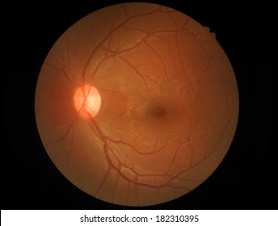
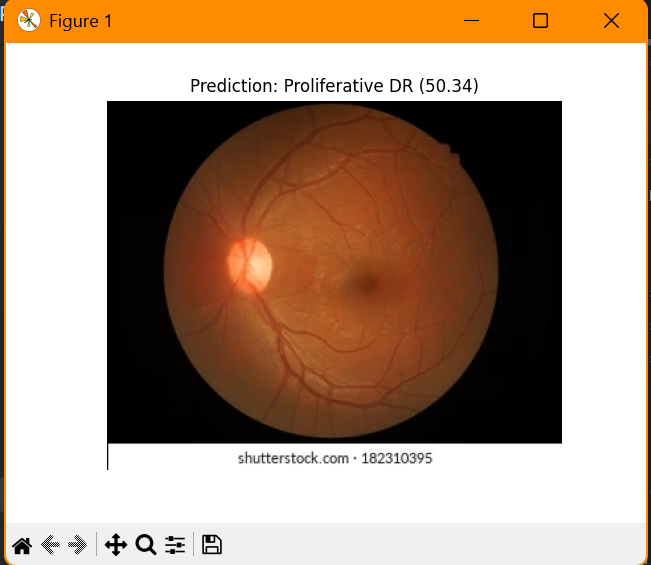
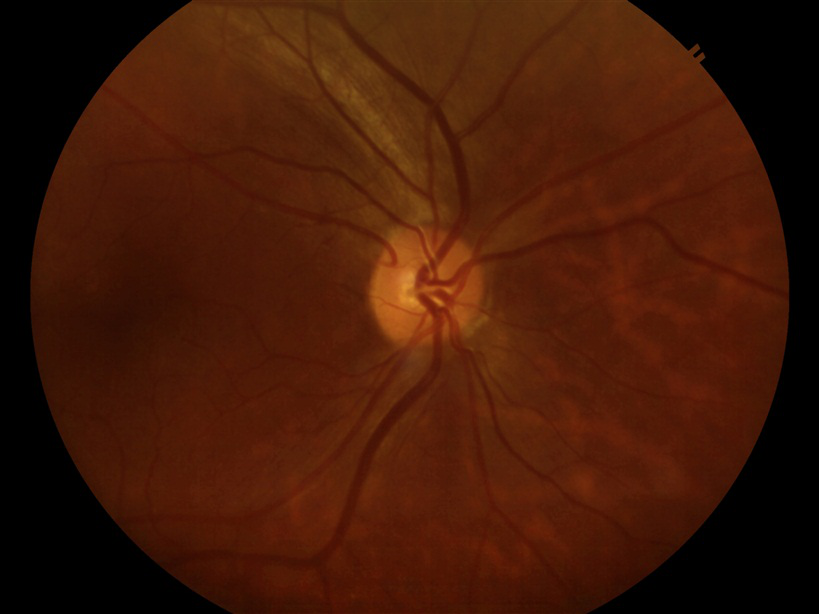
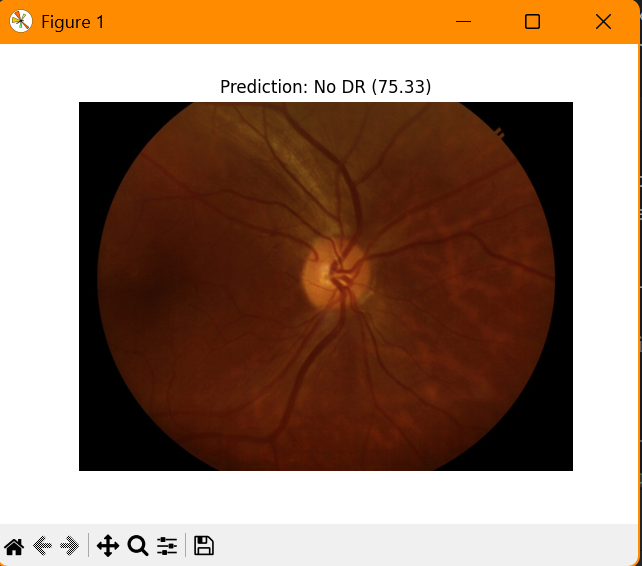
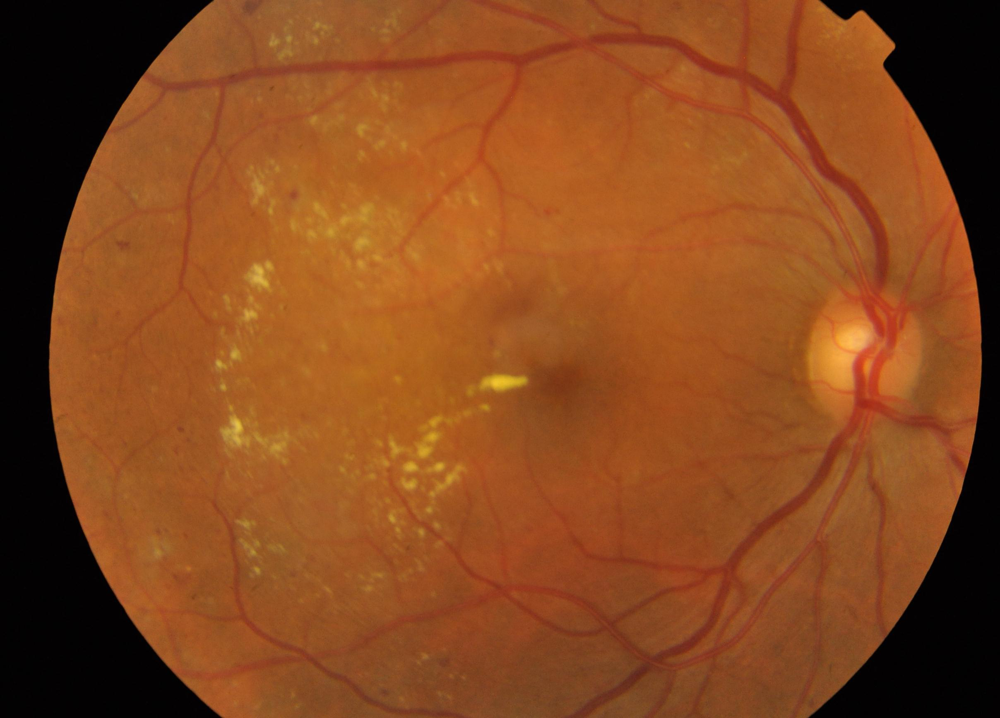
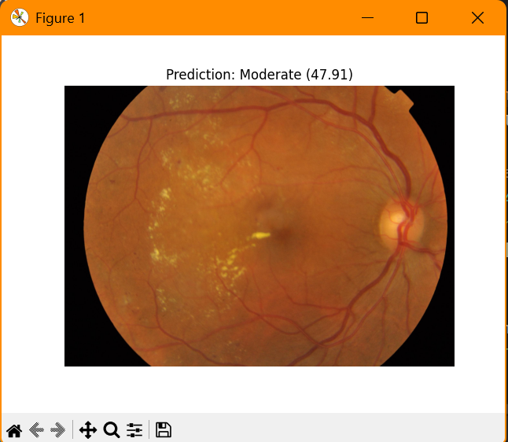
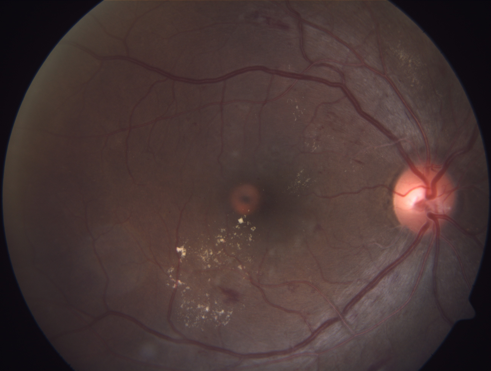
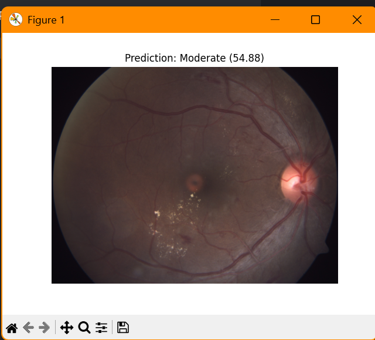

# 👁️ Retinopathy Detector – AI-Based Diabetic Eye Screening


Retinopathy Detector is a deep learning-powered image classification tool that helps identify the severity of diabetic retinopathy from retinal fundus images. The model is trained using a dataset of eye images, with labels stored in a CSV file indicating severity levels like No DR, Mild, Moderate, and Severe.

---

## 🧠 Features
🔍 CNN-based Detection – Trained on a labeled dataset of retinal images for robust classification.

📊 CSV Integration – Reads labels from a CSV file; easy to modify and extend.

📁 Batch Inference – Supports processing an entire folder of images.

⚡ Quick Predictions – Lightweight inference script using pretrained model.

---

## 🏷️ Labels Used
### The CSV contains severity levels for each image:
```
0 → No DR

1 → Mild

2 → Moderate

3 → Severe
```

These are mapped automatically by the model during training and prediction.

---

## 🛠️ Tech Stack
Language: Python 3.8+

Libraries: TensorFlow/Keras, Pandas, NumPy, OpenCV

Model: CNN classifier (customizable)

Data: Images + CSV with severity levels

---

## Download the model:

[Click here to download model](https://drive.google.com/file/d/1YsYagbGw1qrmyF5MOW_oOjiMwkGZ-cjp/view?usp=sharing)

Place retinopathy_model.h5 in the project root folder.

---

## 🚀 Getting Started
```bash 
# Clone the repository
git clone https://github.com/n-bharath-chowdary/Retinopathy-Detector.git
cd Retinopathy-Detector

# Set up environment
python -m venv venv
source venv/bin/activate  # or venv\Scripts\activate on Windows

# Install dependencies
pip install -r requirements.txt

# Run predictions
python app.py
```
---

## 🖼️ Sample Output

| Input | Output  |
|------------|-----------|
|  |  |
|  |  |
|  |  |
|  |  |

Each prediction is appended to a new CSV or displayed in the terminal.

---

## 💡 Use Cases
🧪 Medical image processing practice

🩺 Automated DR screening system prototype

📚 Academic/portfolio deep learning project

---


## 📢 Contribute

Got ideas? Found a bug?
Open an Issue or submit a Pull Request – all contributions are welcome!


---

## 📄 License

This project is licensed under the MIT License. See the LICENSE file for details.


---

## 💬 Connect

## 🙋‍♂️ Author
#### Bharath Chowdary
##### [GitHub](https://github.com/n-bharath-chowdary) 
##### [LinkedIn](https://www.linkedin.com/in/n-bharath-chowdary/)
---
